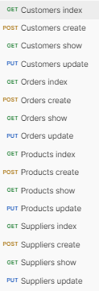

<h1>Projecto BackEnd Flag 2023 - Ricardo Logrado</h1>
<h2>Pombo e Filhos, Lda - Software de gestão de stock</h2>

## Memória Descritiva

Este projeto foi criado recorrendo a Laravel para a criação de toda a estrutura da app, migrações, controllers, models e rotas.

Para testar foi utilizado o Postman

Desde o inicio que o objectivo seria criar uma api que me desse a possibilidade de ser consumida por um projecto em ReactJs, daí a minha opção ter sido recorrer a RestApi 

## Descrição do projeto:

O objetivo deste projecto é criar um software que permita a gestão de stocks dos produtos da Empresa Pombo e Filhos

Foi utilizado para este projecto a framework Laravel com recurso a RestApi e a controladores criados em CRUD

Através desta documentação vou explicar como instalar o projecto e como utilizar

Vamos precisar para este projecto o Laraval como framework e o Postman para testar

Antes de criar o seu primeiro projeto Laravel, certifique-se de que a máquina local tem o PHP e Composer instalados.
 Depois de instalar o PHP e o Composer, pode-se criar um novo projeto Laravel através do comando create-project do Composer:

## Instalação:

<a href="https://laravel.com/docs/10.x/installation" target="_blank" rel="">Clica aqui para ver o manual de installação do Laravel.</a>

Depois de instalado devemos correr o comando na consola:
    php artisan serve

Depois de iniciar o servidor de desenvolvimento Artisan, seu aplicativo estará acessível no seu navegador em <strong><a href="http://localhost:8000" target="_blank">http://localhost:8000</a></strong>. A seguir, você está pronto para começar a dar os próximos passos no ecossistema Laravel. Claro, você também pode querer configurar um banco de dados.

##Utilização:

Como muitos dos valores das opções de configuração do Laravel podem variar dependendo se sua aplicação está sendo executada em sua máquina local ou em um servidor web de produção, muitos valores de configuração importantes são definidos usando o arquivo <strong>.env</strong> que existe na raiz da sua aplicação .

Seu arquivo <strong>.env</strong> não deve ser submetido ao controle de origem do seu aplicativo, pois cada desenvolvedor/servidor que usa seu aplicativo pode exigir uma configuração de ambiente diferente. Além disso, isso seria um risco de segurança caso um intruso obtivesse acesso ao seu repositório de controle de origem, uma vez que quaisquer credenciais confidenciais seriam expostas.

Depois de configurar seu banco de dados MariaDB, você poderá executar as migrações de banco de dados de sua aplicação, que criarão as tabelas de banco de dados de sua aplicação:

Todas as tabelas criadas vão ter uma migração e um Model, pode ou não existir um controlador para as tabelas, para os controladores foi usado CRUD "Create Read Update Delete"

As migrações por sua vez são criadas através do comando

Ao adicionar <strong>-mc</strong> criamos em simultâneo a migração, o model e o controlador.

As migrações:

Os models:

E os controllers:

As rotas estão todas no ficheiro api.php:

Dentro dos controladores foi utilizado o CRUD onde temos o Create Read Update e Delete, no meu caso chamei store, show e update, o destoy não foi incluido nos projecto, visto que o id auto-incrementa não existe essa necessidade diminuindo assim a probabilidade de gerar erros na tabela ao fazer update das mesmas.

<!-- 
Temos então o show all que é feito através do index

Recorrendo ao model, conseguimos obter todos os dados referentes a essa tabela.

O store:

No store foram feitas validações onde alguns campos não podiam ficar vazios para que ao fazer o <strong>POST</strong> se pudesse gerar um novo user.

foi criada também uma validação de stock para nunca haver o problema de se fazer uma encomenda na qual não existe stock diponivel

Foi também criada uma validação ao tentar criar um novo produto, caso o produto já exista apenas é actulizado o stock como pdemos verificar abaixo:

O update:

Mais tarde estes campos podem ser atualizados através do <strong>UPDATE</strong>

No update é possível inserir os restantes campos ou modificar os submetidos no create, no entanto foram criados alguns <strong>IF</strong> e <strong>ELSE</strong> com erros associados para melhor leitura do utilizador sobre o que não estava a ser feito corectamente.

E o show by $id:

No show by $id temos então os <strong>join's</strong> de várias tabelas onde através deles conseguimos adquirir vários tipos de informação.

Para o caso dos <strong>Users</strong> fez-se a ligação com a tabela <strong>Orders</strong>, com a tabela <strong>Products</strong> e a tabela <strong>Products_has_orders</strong>. Com esta ligação conseguimos retornar todas as orders feitas por este user como os products a elas associadas e respectivos dados. Na imagem abaixo podemos verificar o <strong>.Json</strong> com esses dados.

## Como iniciar:

Para o projecto devemos em primeiro lugar correr a seguinte migração:

Depois de correr a migração Warehouse_table, podemos correr todas as outras através do comando:

como resultado obtemos esta resposta no terminal:

## Como testar:

Para testar a aplicação foi utilizado o <strong><a href="https://www.postman.com/" target="_blank">https://www.postman.com/</a></strong>

Em primeiro lugar devemos começar por criar as rotas de <strong>Supplier</strong> como na imagem abaixo:

Depois temos de criar em primeiro lugar o supplier.

Através da seguinte rota:

No body do <strong>POST</strong> temos de colocar:

Caso o <strong>Supplier</strong> seja bem inserido iremos receber uma mensagem de sucesso. Caso o <strong>Supplier</strong> já exista será retornado uma mensagem de erro.

O mesmo processo terá de ser aplicado para todas as outras rotas.

Teremos de preencher o body no <strong>Postman</strong> com os parametros obrigatórios para podermos ir preenchendo as tabelas.

## Dificuldades:

A certo poonto tive de refazer todo o meu projeto por estar a exigir demasiado de mim próprio. Nessa altura decidi parar e falar com os meus colegas (porque eu não vejo o curso como uma competição de notas, mas sim como um grupo de trabalho que gostava bastante que nos podesse-mos apoiar uns aos outros mutuamente) e mais tarde falei com o Alexandre sobre o reinicio.

Nessa altura decidi simplificar o meu projeto tornando-o mais simples, o que correu bastante bem.

Penso que consegui cumprir praticamente todos os requisitos solicitados, no entanto tive dificuldades ao fazer os joins entre tabelas e de obter alguns resultados onde eu desejava.

Com o auxilio do Alexandre consegui perceber a lógica e implementar os joins de forma a que tudo ficasse a funcionar como pertendido.

Fiquei com um problema se é que assim o posso dizer, quando crio a order, tenho sempre de correr a order pelo id para atualizar o valor total, tentei colocar as linhas de código noutras partes do controlador mas sem sucesso. No entanto para um layout funcional, ao entrar numa order o valor estaria atualizado. 

## Conclusões:

Nas conclusões, tiro que com alguma paciência consegui chegar a bom porto.

Foi um projeto bastante desafiante ao qual estou bastante satisfeito de chegar aos resultados obtidos.
 -->
