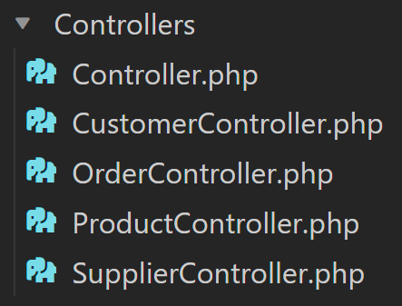

<h1>Projecto BackEnd Flag 2023 - Ricardo Logrado</h1>
<h2>Pombo e Filhos, Lda - Software de gestão de stock</h2>

## Memória Descritiva

Este projeto foi criado recorrendo a Laravel para a criação de toda a estrutura da app, migrações, controllers, models e rotas.

Para testar foi utilizado o Postman

Desde o inicio que o objectivo seria criar uma api que me desse a possibilidade de ser consumida por um projecto em ReactJs, daí a minha opção ter sido recorrer a RestApi 

## Descrição do projeto:

O objetivo deste projecto é criar um software que permita a gestão de stocks dos produtos da Empresa Pombo e Filhos

Foi utilizado para este projecto a framework Laravel com recurso a RestApi e a controladores criados em CRUD

Através desta documentação vou explicar como instalar o projecto e como utilizar

Vamos precisar para este projecto o Laraval como framework e o Postman para testar

Antes de criar o seu primeiro projeto Laravel, certifique-se de que a máquina local tem o PHP e Composer instalados.
 Depois de instalar o PHP e o Composer, pode-se criar um novo projeto Laravel através do comando create-project do Composer:

## Schema:

## Instalação:

<a href="https://laravel.com/docs/10.x/installation" target="_blank" rel="">Clica aqui para ver o manual de installação do Laravel.</a>

Depois de instalado devemos correr o comando na consola:
    php artisan serve

Depois de iniciar o servidor de desenvolvimento Artisan, seu aplicativo estará acessível no seu navegador em <strong><a href="http://localhost:8000" target="_blank">http://localhost:8000</a></strong>. A seguir, você está pronto para começar a dar os próximos passos no ecossistema Laravel. Claro, você também pode querer configurar um banco de dados.

## Utilização:

Podem encontrar o export do Postman na pasta <strong>.public\assets\Postman-Export</strong>

Como muitos dos valores das opções de configuração do Laravel podem variar dependendo se sua aplicação está sendo executada em sua máquina local ou em um servidor web de produção, muitos valores de configuração importantes são definidos usando o arquivo <strong>.env</strong> que existe na raiz da sua aplicação .

Seu arquivo <strong>.env</strong> não deve ser submetido ao controle de origem do seu aplicativo, pois cada desenvolvedor/servidor que usa seu aplicativo pode exigir uma configuração de ambiente diferente. Além disso, isso seria um risco de segurança caso um intruso obtivesse acesso ao seu repositório de controle de origem, uma vez que quaisquer credenciais confidenciais seriam expostas.

Depois de configurar seu banco de dados MariaDB, você poderá executar as migrações de banco de dados de sua aplicação, que criarão as tabelas de banco de dados de sua aplicação:

Todas as tabelas criadas vão ter uma migração e um Model, pode ou não existir um controlador para as tabelas, para os controladores foi usado CRUD "Create Read Update Delete"

As migrações por sua vez são criadas através do comando

Ao adicionar <strong>-mc</strong> criamos em simultâneo a migração, o model e o controlador.

As migrações:

Os models:

E os controllers:

As rotas estão todas no ficheiro api.php:

Dentro dos controladores foi utilizado o CRUD onde temos o Create Read Update mas não o Delete, que foi excluido de forma a simplificar o projecto.

Temos então o show all que é feito através do index

Recorrendo ao model, conseguimos obter todos os dados referentes a essa tabela.

O store:

O update:

Mais tarde estes campos podem ser atualizados através do <strong>UPDATE</strong>

No update é possível inserir os restantes campos ou modificar os submetidos no create, no entanto foram criados alguns <strong>IF</strong> e <strong>ELSE</strong> com erros associados para melhor leitura do utilizador sobre o que não estava a ser feito corectamente.

E o show by $id:

## Como testar:

Para testar a aplicação foi utilizado o <strong><a href="https://www.postman.com/" target="_blank">https://www.postman.com/</a></strong>

Em primeiro lugar devemos começar por criar as rotas como na imagem abaixo:

Depois das rotas criadas podemos avançar com os testes das Orders

Por ordem devemos primeiro criar Suppliers:

<break>{ 
        &emsp;"company_name":"Worten", 
        &emsp;"phone":"911234567", 
        &emsp;"email":"worten@gmail.com", 
        &emsp;"address":"Almada", 
        &emsp;"postal_code":"2805", 
        &emsp;"type":"Electronics", 
        &emsp;"NIF":"321321321" 
      }
</break>

Depois Products, sendo que os products pode pertencer a 1 ou a vários suppliers:

<break>{ 
    &emsp;"brand":"Apple", 
    &emsp;"model":"Macbook Air", 
    &emsp;"serial_number":"1234512345", 
    &emsp;"type":"Electronics", 
    &emsp;"unit_price":"1200", 
    &emsp;"units_in_stock":"200", 
    &emsp;"units_on_order":"5", 
    &emsp;"discontinued":"No", 
    &emsp;"supplier_ids": [1,2] 
  }
</break>

E finalmente podemos criar uma Order, que pode conter vários Products e, que vai também somar o valor total não só dos diferentes items adicionados, mas também o numero de vezes que um item especifico foi adicionado á Order:

<break>
{ 
    &emsp;"postal_code": "4444-123", 
    &emsp;"order_date": "2023-11-20", 
    &emsp;"shipped_date": "2023-11-22", 
    &emsp;"products": [ 
        &emsp;&emsp;{ 
            &emsp;&emsp;&emsp;"ProductID": 2, 
            &emsp;&emsp;&emsp;"quantity": 1 
        &emsp;&emsp;}, 
        &emsp;&emsp;{ 
            &emsp;&emsp;&emsp;"ProductID": 3, 
            &emsp;&emsp;&emsp;"quantity": 1 
        &emsp;&emsp;} 
    &emsp;] 
  }
</break>

## Dificuldades:

Não foi um projecto fácil de executar, e mesmo após muitas dificuldades, o projecto não está a 100%

Inicialmente compliquei bastante na altura de desenhar o schema pois tendo a visualizar o produto final e não o caminho que leva lá.

Com o Auxilio dos meus colegas, pouco a pouco tenho vindo a entender melhor o que é a lógica do código.

O Alexandre também me instigou bastante a dar o melhor de mim e a ver as coisas como elas devem ser vistas, que é, uma coisa de cada vez, partidas em segmentos pequenos que pouco a pouco, quando unidos, se vão tornando em segmentos maiores até que finalmente se chega ao panorama maior.

Durante o processo de criação, fiz migrações , refresh, e resets incontáveis e, pelo meio deparei-me com o facto de uma migração aparecer como já existente, logo, não podia ser migrada novamente. a solução prendeu-se com a adição de  no "UP" da migração.

Apenas hoje, 4 dias depois, descobri que o erro afinal era uma outra migração com o mesmo nome que eu tinha criado sem dar conta. De qualquer forma, agora toadas as migrações deste projecto têm um "drop-if-exists" no "UP"

## Conclusões:

É preciso um trabalho continuo, basicamente diário nesta fase de aprendizagem, não só na utilização do código mas também no desenvolvimento de lógica

Aprender isto aos 40 foi de longe o objectivo mais desafiante a que alguma vez me propus

